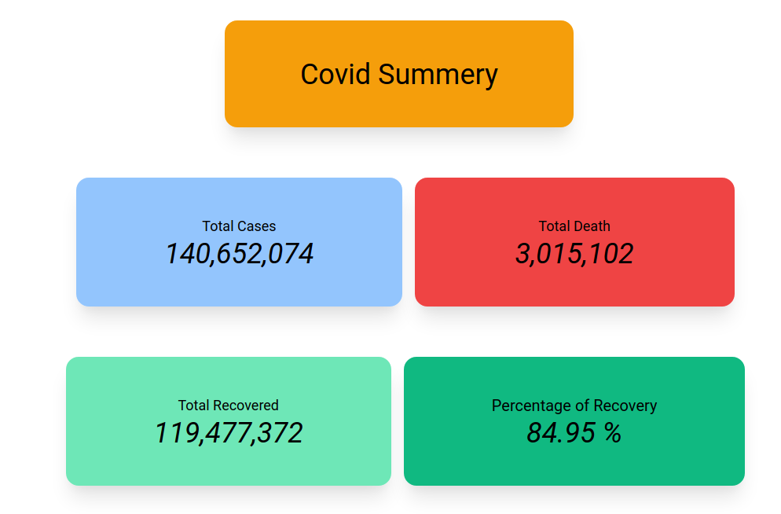

# Covid Tracker

### Scraps data from a website and displays them

<hr>

## Demo

<table>
  <tr>
    <td>Covid Tracker</td>
  </tr>
  <tr>
    <td></td>
  </tr>

 </table>
<br/><hr><br/>

## Stacks

- Python
- Flask
- BeautifulSoup
- requests
- Tailwind CSS

<br/><hr><br/>

## Features

```
1. Scraps and extracts data from website
2. Display info in template
```
